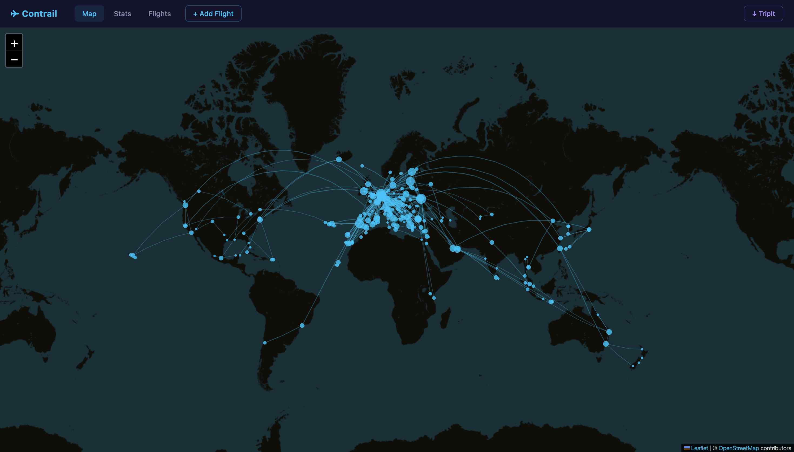
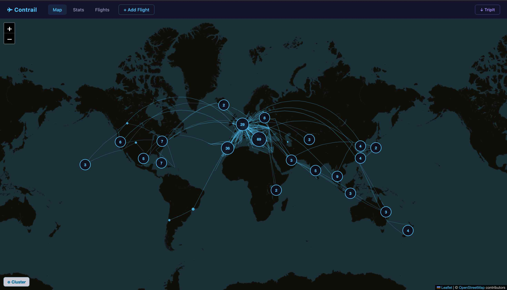

# Contrail

A personal flight tracker that runs on localhost — a modern replacement for [openflights.org](https://openflights.org/). In the description below, it is assumed that the repo is stored in the folder `contrail`. Terminal commands assume macOS.

Features:
- **World map** of all your routes with great-circle arcs and airport markers
- **Stats dashboard** — total distance, flight hours, airports, countries, airlines, top routes, and a flights-per-year chart
- **Full flight list** with search and sortable columns
- **Add a flight by flight number + date** — the app looks up departure/arrival airports, airline, aircraft, and duration automatically via AeroDataBox

Data is stored locally in `data/flights.json`. MongoDB support can be added later.





## Setup

Tested with Node.js 18+.

### 1. Install dependencies

Run this command inside the `contrail` folder:

```
npm install
```

This installs Express, the only dependency.

### 2. Configure the project

Configuration uses two files: `default.config` (committed, provides defaults) and `config` (gitignored, required, overrides defaults). Copy the default to get started:

```
cp default.config config
```

The app will not start if `config` is missing or contains invalid JSON. The config parameters are:

* `port`: port the server listens on (default: `3000`).
* `data_dir`: directory used for runtime data files (default: `data`). Gitignored.
* `flights_file`: path to the JSON file where flights are stored (default: `data/flights.json`).
* `airports_file`: path to the OpenFlights airport database (default: `data/airports.dat`). Downloaded automatically on first run.
* `csv_backup`: filename of an openflights.org CSV export to import on first run (default: `openflights-backup-2026-09-08-1328.csv`). Update this if your backup file has a different name.

### 3. Set up secrets

Copy `default.secret` to `secret` and fill in your API key:

```
cp default.secret secret
```

Then open `secret` and add your RapidAPI key:

```json
{
  "rapidapi_key": "YOUR_KEY_HERE"
}
```

The `secret` file is gitignored and will never be committed.

#### Getting a free RapidAPI key for flight lookup

The flight lookup feature (add flight by number + date) uses the [AeroDataBox API](https://rapidapi.com/aedbx-aedbx/api/aerodatabox) via RapidAPI. The free tier provides 500 requests per month, which is sufficient for personal use.

1. Sign up at [rapidapi.com](https://rapidapi.com)
2. Subscribe to the AeroDataBox API (free tier)
3. Copy your `X-RapidAPI-Key` from the API console into `secret`

Flight lookup is optional — if no key is configured, you can still add flights by filling in the details manually.

#### TripIt import (past and future flights)

Click the **↓ TripIt** button in the nav bar. Two methods are supported:

**Method 1 — Calendar URL (no credentials required)**

1. Go to tripit.com → Profile → Account → Email & Calendar
2. Copy the link under *Subscribe to your travel schedule*
3. Paste it into the import dialog and click **Import**

**Method 2 — OAuth (one-time setup, more complete data)**

Imports directly via the TripIt API and includes cabin class, seat, and aircraft type.

1. Register a developer app at [tripit.com/developer](https://www.tripit.com/developer)
2. Add the Consumer Key and Consumer Secret to `secret`:

```json
{
  "tripit_client_key": "YOUR_CLIENT_KEY",
  "tripit_client_secret": "YOUR_CLIENT_SECRET"
}
```

3. Restart the server — an **Authorise with TripIt** button appears at the top of the import dialog
4. Click it, approve access in TripIt, and you are redirected back with an import count

Existing flights (matched by date + route + flight number) are never duplicated.

## Running

Start the server:

```
node app.js
```

Then open [http://localhost:3000](http://localhost:3000) in your browser.

On first run, the app will:
1. Create the `data/` directory
2. Download `airports.dat` from the [OpenFlights dataset](https://github.com/jpatokal/openflights) (~6 MB, ~7700 airports)
3. Import your flights from the CSV backup file specified in `csv_backup` and save them to `data/flights.json`

Subsequent starts skip all of these steps and load from `data/flights.json` directly.

## Importing your openflights.org data

Export your flights from openflights.org as a CSV and place the file in the root of the repo. Update `csv_backup` in `default.config` (or your `config` file) to match the filename. Delete `data/flights.json` if it already exists, then restart the server — the CSV will be re-imported.

The importer understands the standard openflights.org CSV format:

```
Date,From,To,Flight_Number,Airline,Distance,Duration,Seat,Seat_Type,Class,Reason,Plane,Registration,Trip,Note,From_OID,To_OID,Airline_OID,Plane_OID
```

Missing distances are computed automatically from airport coordinates using the Haversine formula.

## Adding a flight

1. Click **+ Add Flight** in the navigation bar
2. Enter the flight number (e.g. `KL1234`) and the departure date
3. Click **Look Up Flight** — the app calls AeroDataBox and fills in departure airport, arrival airport, airline, aircraft type, distance, and duration
4. Review and correct any fields if needed, then click **Save Flight**

If the flight is not found (common for historical flights), click **Fill Manually** and enter the details yourself. The minimum required fields are **From**, **To**, and **Date**.

## Data

All flight data is stored in `data/flights.json` as a JSON array. The `data/` directory is gitignored so your personal flight data is never committed to the repository.

To back up your data, copy `data/flights.json` to a safe location.

Fields stored per flight:

| Field | Description |
|-------|-------------|
| `date` | Departure date/time (`YYYY-MM-DD` or `YYYY-MM-DD HH:MM:SS`) |
| `from` | Departure airport IATA code |
| `to` | Arrival airport IATA code |
| `flight_number` | Flight number (e.g. `KL1234`) |
| `airline` | Airline name |
| `distance` | Great-circle distance in km |
| `duration` | Flight duration in `HH:MM` format |
| `plane` | Aircraft type (e.g. `Boeing 737 MAX 8`) |
| `seat` | Seat number |
| `seat_type` | Seat type (window/aisle/middle) |
| `class` | Cabin class (`Y` = economy, `C` = business, `F` = first) |
| `reason` | Trip reason (`B` = business, `L` = leisure) |
| `registration` | Aircraft registration |
| `trip` | Trip name or ID |
| `note` | Free-text note |

## API

The server exposes a simple REST API:

| Method | Path | Description |
|--------|------|-------------|
| `GET` | `/api/flights` | Return all flights as a JSON array |
| `GET` | `/api/airports` | Return airport metadata for all airports in your flights |
| `POST` | `/api/flights/lookup` | Look up a flight by number and date via AeroDataBox |
| `POST` | `/api/flights` | Add a new flight |

`POST /api/flights/lookup` request body:
```json
{ "flight_number": "KL1234", "date": "2026-09-09" }
```

`POST /api/flights` request body: a flight object with at least `from`, `to`, and `date`.

## Migrating to MongoDB

The current data layer in `app.js` reads and writes a single JSON file. To switch to MongoDB:

1. Install Mongoose: `npm install mongoose`
2. Replace the `flights` array and `saveFlights()` / `init()` functions in `app.js` with Mongoose model operations, following the same pattern used in the `trust-crowdsourced` project
3. Set the `CONNECTION` environment variable (or add `mongodb_uri` to `secret`) and connect in `app.js`

The REST API routes do not need to change.

## Troubleshooting

### airports.dat download fails on first run

The app tries to download airport data from GitHub on startup. If you are offline or the download fails, you can download it manually:

```
curl -o data/airports.dat https://raw.githubusercontent.com/jpatokal/openflights/master/data/airports.dat
```

The map will still render without this file, but route arcs and airport markers will not appear.

### Flight lookup returns "No RapidAPI key in secret file"

The `secret` file either does not exist or has an empty `rapidapi_key`. See the [Set up secrets](#3-set-up-secrets) section above.

### Port already in use

Change `port` in `default.config` (or your `config` file) to any available port, then restart.

### CSV import does not find the backup file

Check that `csv_backup` in your config matches the exact filename of your CSV export, including the date suffix. The file must be in the root of the repo (same folder as `app.js`).
